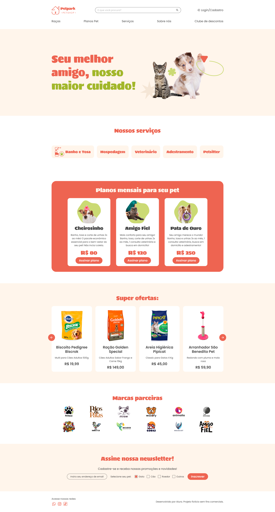

# PetPark

Conheça o **PetPark**: o destino ideal para os cuidados do seu pet!  
Oferecemos serviços completos, desde banho e tosa até adestramento, com profissionais dedicados ao bem-estar dos animais.

> ⚠️ Este site é um projeto fictício desenvolvido em conjunto com o curso CSS: explorando seletores e utilizando variáveis da Alura, para fins de estudo e prática de HTML e CSS.

---

## 🔨 Funcionalidades do projeto

O site possuirá as seguintes funcionalidades:

- Página estática com os principais **planos**, **ofertas**, **serviços** e **parceiros**.

---

## ✔️ Técnicas e tecnologias utilizadas

O projeto utiliza as seguintes tecnologias:

- `HTML` – Para estrutura e marcação dos elementos da página.
- `CSS` – Para criação da identidade visual com estilos personalizados.
- `Figma` – Utilizado para prototipagem visual do layout (referência visual).